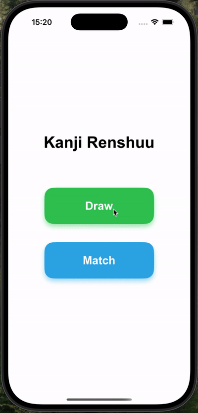

# 🈸 KanjiRenshuu (WIP)

**KanjiRenshuu** is an educational iOS app that helps learners practice writing Japanese kanji characters. It supports drawing practice with live stroke demos and blueprint overlays. A second practice mode — matching kanji to their meanings — is currently under development.

---

## ✨ Features

- 🎨 **Drawing Practice**
  - Browse kanji by school grade level
  - See readings, meanings, and animated stroke order
  - Draw directly on a blueprint overlay
  - Clear canvas with "Retry" button
  - Continue to next kanji with "Continue" button

- 🔜 **Matching Mode** *(under development)*
  - Match kanji with their correct English meanings

- 🧭 Easy navigation between kanji and grade levels

---

## 🧱 Tech Stack

- **UIKit** — native UI development  
- **MVVM architecture** — maintainable code structure  
- **CocoaPods** — dependency management  
- **SnapKit** — declarative Auto Layout  
- **SVGKit** — rendering SVG blueprints for kanji  
- **Kanji Alive API** — retrieving kanji metadata and stroke animations  

---

## 🚧 Status

This app is a **work in progress**. Drawing mode is functional and under testing. Matching mode is in early development.

---

## ⚠️ Known Limitations

- **Missing SVG Files**  
  Kanji SVG blueprint files are stored in the app bundle but **not included in the repository**.  
  → *Planned*: Host these files on a cloud platform (e.g., Firebase) for easier access.

- **Kanji Alive API Key**  
  The app requires an API key for the [Kanji Alive API](https://kanjialive.com/api/).  
  The key is stored in a `.plist` file that is `.gitignore`d for security reasons.  
  → To run the app, obtain your own API key and add it as described in the project setup.

---

## 🚀 Getting Started

> _To build and run the app locally:_

1. Clone the repo: https://github.com/dwange/KanjiRenshuu.git

2. Install Dependencies

The project uses CocoaPods for dependency management.

3. Setup API Key

The app requires a Kanji Alive API key to fetch kanji data.

How to get your API key:

Visit Kanji Alive API registration page.
Register and obtain your API key.

How to add your API key:

In the project folder, create a new file named: KanjiRenshuuConfig.plist
The plist should contain a dictionary with the key KANJI_ALIVE_API_KEY and your API key as the value.

5. Handle Missing SVG Blueprints

Currently, the kanji SVG blueprint files used by the app are not included in the repo.
You will need to obtain these files separately or wait for the future cloud hosting solution.

6. Open and Run the App

